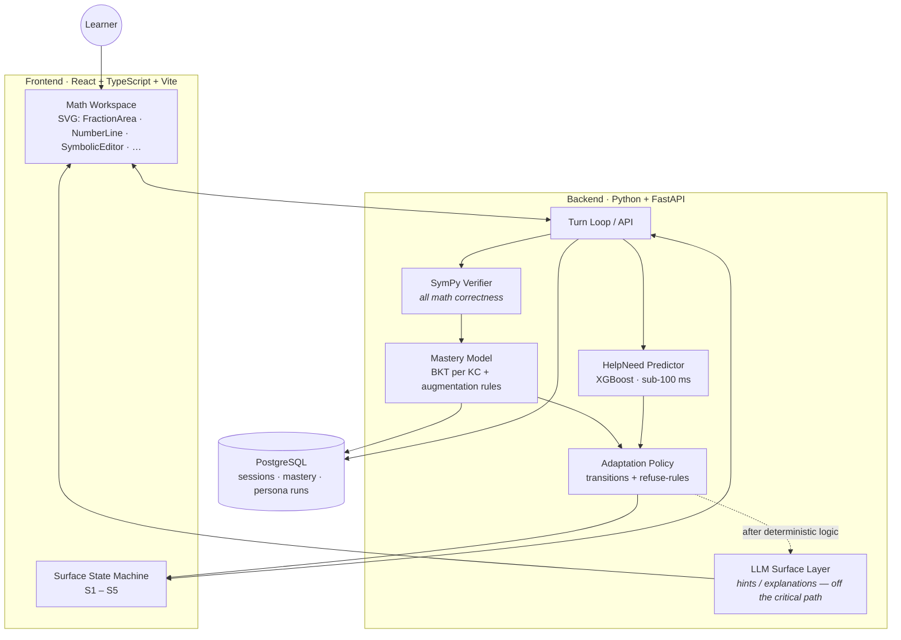
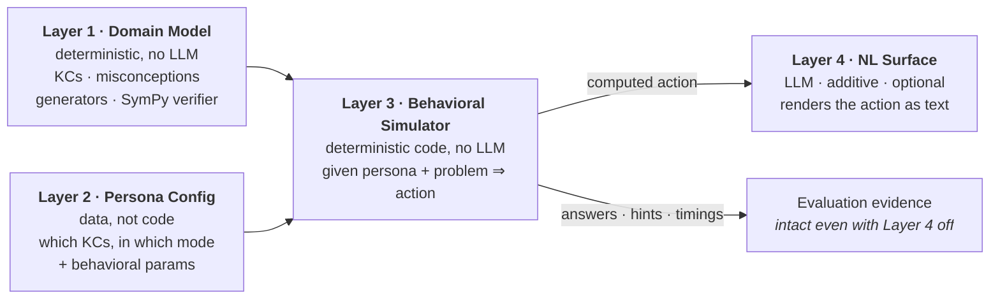
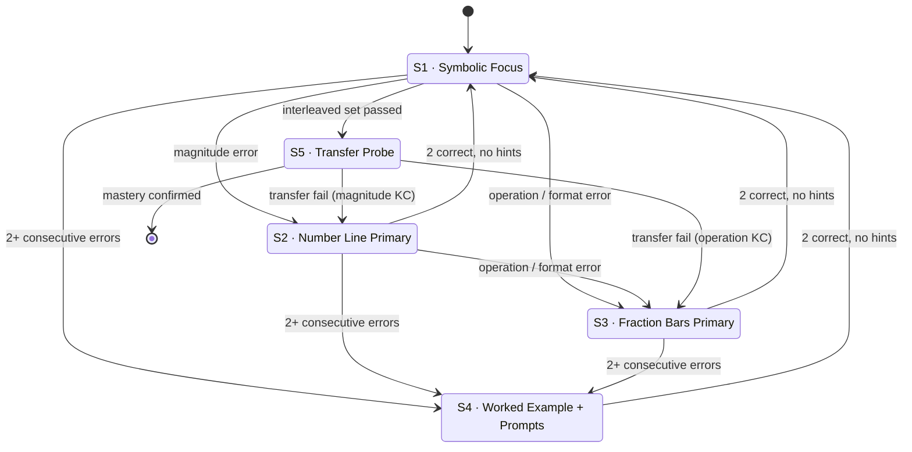
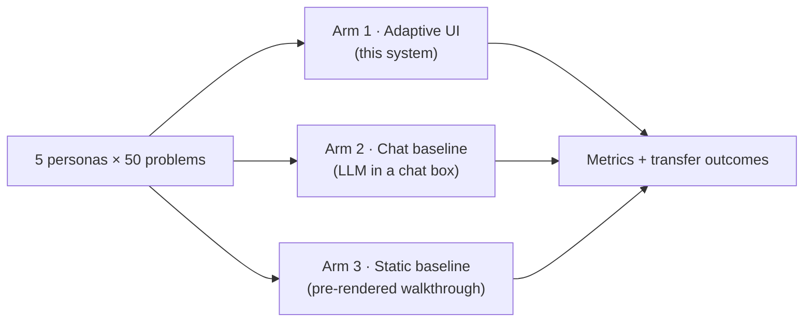
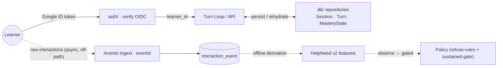

# Architecture

> The technical reference for WhollyMath — an adaptive, multimodal **Grade-6 math** tutor.
> This document is the canonical, in-repo explanation of *how* the system is built and *why*
> it is built that way. Deeper design rationale, the decision log, and research citations live
> in the team's internal planning docs (local-only); this file is the public, follow-along
> technical map.

**Audience:** anyone reading the repo for the first time — a new contributor, a reviewer, or
future us. If you read this top to bottom, you will understand every major moving part and
the invariants that hold them together.

---

## Table of contents

1. [The one-paragraph version](#1-the-one-paragraph-version)
2. [Design philosophy](#2-design-philosophy)
3. [System overview](#3-system-overview)
4. [The learning domain (what we teach)](#4-the-learning-domain-what-we-teach)
5. [Layer-by-layer: the synthetic-learner harness](#5-layer-by-layer-the-synthetic-learner-harness)
6. [The mastery model](#6-the-mastery-model)
7. [The adaptive UI: surface states & policy](#7-the-adaptive-ui-surface-states--policy)
8. [The proactive HelpNeed layer](#8-the-proactive-helpneed-layer)
9. [Content validation](#9-content-validation)
10. [The turn loop (request lifecycle)](#10-the-turn-loop-request-lifecycle)
11. [Evaluation architecture](#11-evaluation-architecture)
12. [Technology choices](#12-technology-choices)
13. [Repository layout](#13-repository-layout)
14. [Architectural invariants (never break these)](#14-architectural-invariants-never-break-these)
15. [The persistent learner: identity, continuity & behavioral capture](#15-the-persistent-learner-identity-continuity--behavioral-capture)
16. [V2 AI expansion — decisions](#16-v2-ai-expansion--decisions)

---

## 1. The one-paragraph version

WhollyMath is a web tutor that teaches the **full Grade-6 math standard** — 9 units / 44
playable knowledge components (ratios, the number system, expressions & equations, geometry,
statistics, plus TEKS-only integer arithmetic and financial literacy) — to 6th–7th graders.
It adapts its interface to what the learner *demonstrably* understands using a small,
disciplined set of surface states, and it declares "mastery" only through a model that is
explicitly defended against guessing, pattern-matching, and over-reliance on hints. All math
correctness is decided by **symbolic computation (SymPy)** — never by a language model. The
engine is curriculum-general; its adversarial **synthetic-learner harness** and three-arm
evaluation were designed and stress-tested on the fraction core (five deterministic personas,
each a documented misconception), and the same behavioral model generalizes across the
curriculum — with a **transfer test** as the moment of truth.

---

## 2. Design philosophy

Three principles shape every decision below.

- **Rules decide what happened; the LLM only describes what it looks like.** Every correctness
  judgment, mastery update, and state transition is deterministic. The LLM is confined to
  generating natural language *after* the deterministic logic has run. The system must be able
  to run with all LLM features disabled and lose only surface fluency — never evidence.
- **Mastery must be earned, not gamed.** A learner who guesses, pattern-matches a single
  representation, or leans on scaffolding does not reach "mastered." The mastery model encodes
  this directly, and the synthetic personas exist to attack it.
- **Adapt with restraint.** A UI that constantly morphs is a worse result than one that holds
  still. There are exactly five surface states, transitions are always labeled, and a set of
  hard refuse-rules constrain what the interface will *never* do automatically.

---

## 3. System overview

WhollyMath instantiates the classic four-component intelligent-tutoring-system loop — a
**domain model** of expert knowledge, a **student model** tracking mastery, a **pedagogical
model** choosing the next move, and an **interface** delivering problems and feedback.



The **synthetic-learner harness** and **evaluation pipeline** (Sections 5 and 11) sit beside
this loop: they drive personas through the same tutor to measure whether the mastery model can
be fooled, and to compare the adaptive UI against baselines.

---

## 4. The learning domain (what we teach)

The curriculum is the **full Grade-6 math standard**, organized as **9 units / 54 catalog
lessons / 44 engine-served knowledge components (KCs)**. The KC — not the unit — is the unit of
mastery: "mastered fractions" is meaningless; "mastered KC_add_common_denom" is trackable. Each
KC carries its canonical correct procedure, its named misconceptions, and the wrong-answer
patterns those misconceptions produce, defined in **Layer 1** (the single source of truth the
mastery model, the personas, and the transfer test all reference).

Coverage is **dual-tagged to CCSS and TEKS where both apply**; two units are TEKS-only
(integer arithmetic and personal financial literacy have no CCSS Grade-6 home). Registries:
`domain/curriculum.py` (units/lessons), `domain/knowledge_components.py` (KC enum),
`domain/lesson_spec.py` (per-KC engine specs).

| # | Unit | Lessons | Standards |
|---|------|---------|-----------|
| 1 | Ratios & Rates | 6 | 6.RP.A · TEKS 6.4/6.5 |
| 2 | Fractions & Decimals | 8 | 6.NS.1–4 · TEKS 6.2E/6.3 |
| 3 | Rational Numbers | 7 | 6.NS.5–8 · TEKS 6.2/6.11 |
| 4 | Integer Arithmetic | 4 | **TEKS-only** 6.3C/6.3D |
| 5 | Expressions | 6 | 6.EE.1–4 · TEKS 6.6/6.7 |
| 6 | Equations & Inequalities | 5 | 6.EE.5–9 · TEKS 6.9/6.10 |
| 7 | Geometry (area/SA/volume) | 6 | 6.G.1–4 · TEKS 6.8 |
| 8 | Statistics | 6 | 6.SP.1–5 · TEKS 6.12/6.13 |
| 9 | Personal Financial Literacy | 6 | **TEKS-only** 6.14A–H |

> **KC counts (be precise):** 47 enum members, **44 engine-served** (LessonSpec + a working
> SymPy generator), 45 referenced by some lesson. Use **44** for "playable KCs the tutor serves."
> Four U8 financial-literacy lessons are `concept_only` (no SymPy generator) by design.

**The fraction core (the original five KCs)** — identify equivalent fractions, find a common
denominator, add / subtract with a common denominator, and place a fraction on a number line —
remains special: it is the deeply-tested heart the synthetic-learner harness (Section 5) was
built against, and it doubles as the **remediation tier** a struggling 6th-grader is routed down
into when a prerequisite is missing.

---

## 5. Layer-by-layer: the synthetic-learner harness

The harness is how we answer "how do you know your synthetic learners aren't just LLMs in
costume?" The answer is the architecture: four layers with strict separation.



- **Layer 1 — Domain Model** (deterministic): the KCs, correct procedures, and misconception
  wrong-answer patterns. No LLM.
- **Layer 2 — Persona Config** (data): each persona is a config — which KCs they hold and in
  what mode (procedure-only / concept-only / both / neither / with-named-misconception), plus
  behavioral parameters (response latency, hint-request probability, engagement floor,
  scaffold-dependence). Adding a sixth persona is editing a config, not writing code.
- **Layer 3 — Behavioral Simulator** (deterministic code): given a persona config and a problem,
  it computes the action — what answer is submitted, whether a hint is requested, how long the
  persona "thinks," what it types when asked to explain. Same input always yields the same
  output. This is what makes the harness reproducible.
- **Layer 4 — Natural-Language Surface** (LLM, additive): the *only* place an LLM enters the
  persona system. It renders the already-computed action as chat text. **It never sees the
  persona's knowledge state** — only what the persona is about to type.

**The five personas** each attack a specific weakness and force a specific mastery rule:

| Persona | Misconception / failure | Signature behavior | Forces |
|---|---|---|---|
| **Natural-number Nate** | Natural-number bias | Fast, confident; right on surface symbolic, wrong on magnitude | Mastery across ≥2 representations |
| **Procedure Priya** | "The procedure is the math" | Correct symbolic answers; can't explain why; fails error-finding | An "explain / find-the-error" item per KC |
| **Hint-hunter Hugo** | Treats hints as the instruction | Requests hints before attempting; collapses without them | ≥1 unassisted correct attempt |
| **Surface Sam** | "Operations are tied to formats" | Near-100% inside a format block; drops on format change | Mastery on **interleaved**, not blocked, practice |
| **Click-through Cleo** | Disengagement (not knowledge) | Sub-2s answers, picks first option, skips prompts | Engagement-floor signals in the mastery model |

The personas are the **integration tests** for the mastery model (Section 6). If a persona who
*should not* reach mastery does, the model is broken. The five personas are deliberately built on
fraction misconceptions — the fraction core is where the harness is deepest — but the mastery
rules they force (representation diversity, unscaffolded evidence, interleaving, engagement
floor) are *behavioral*, not fraction-specific, so they protect mastery declarations across the
whole Grade-6 curriculum.

---

## 6. The mastery model

A **per-KC Bayesian Knowledge Tracing (BKT)** model: each KC has a mastery probability that
updates after each observation. But a probability over a threshold is not enough — that is
exactly how guessing and pattern-matching slip through. Mastery on a KC is declared **only when
all of the following hold**:

1. **BKT probability > τ** (**τ = 0.90**, raised from 0.85 on 2026-05-29 by product-owner
   authorization — at 0.85 BKT could cross the threshold in as few as two corrects; still tuned
   against persona results).
2. **Correctness across ≥ 2 representations** of the same KC (e.g., symbolic *and* number line).
   — defeats *Natural-number Nate*.
3. **≥ 1 correct attempt with no scaffolding** (no hint, no UI assistance). Hinted attempts are
   downweighted. — defeats *Hint-hunter Hugo*.
4. **Computed on varied (interleaved) practice, not a blocked drill.** A run of correct answers
   from one KC *in one representation* counts for less than varied practice — satisfied either by
   interleaving across ≥ 2 KCs or, in a single-skill lesson, by spanning ≥ 2 representations of the
   one KC. — defeats *Surface Sam* (together with rule 2 + the S5 transfer probe); grounded in the
   most-replicated finding in math-practice scheduling research.
5. **≥ 5 scored attempts on the KC** before mastery may be declared — a quantity-of-evidence floor
   so a lucky short streak that clears τ is not mistaken for mastery. Pairs with the raised τ: at
   0.90 two corrects can no longer reach the threshold, and the floor guarantees it.

Plus an **engagement floor**: responses below a time-to-answer floor are flagged, and repeated
low-engagement responses trigger a re-engagement prompt rather than counting as evidence. —
defeats *Click-through Cleo*.

Mastery is then **provisional until the transfer probe (S5) is passed**. A failed transfer
probe demotes the learner back to scaffolded practice for that KC.

---

## 7. The adaptive UI: surface states & policy

Five surface states — a small, enumerated set, each with a defensible reason to exist.

| State | What it is | When it is used |
|---|---|---|
| **S1 · Symbolic Focus** | Numerator/denominator primary; small number line for orientation | Default fluent state |
| **S2 · Number Line Primary** | Number line is the main workspace | After magnitude errors |
| **S3 · Fraction Bars Primary** | Manipulable area-model bars, with live symbolic correspondence | After operation/format errors |
| **S4 · Worked Example + Prompts** | A solved problem revealed step-by-step, each with a "why?" prompt | After the learner is stuck (used sparingly) |
| **S5 · Transfer Probe** | Stripped-down, different representation than recent work, no scaffolds | When the mastery model says ready — this *is* the transfer test |



> Note: a BKT threshold crossing does **not** jump straight to S5. It first triggers a mandatory
> interleaved-practice set (≥ 3 items across recent KCs); only when that set is passed does the
> learner reach S5. This is the rule that turns block-fluency into real mastery evidence.

**Refuse-rules — what the UI will never do automatically:**

1. Never change state mid-problem (transitions happen *between* problems).
2. Never silently remove the learner's own work (prior work is preserved in a panel).
3. Never change state because the learner paused.
4. Never present a new state without a one-line label explaining why.
5. Never auto-help in the first 60 seconds of a problem (except on a wrong answer or explicit
   hint request) — protects productive struggle.
6. When help *is* shown, render it **inline in the workspace**, not as a separate dialog.

---

## 8. The proactive HelpNeed layer

Beyond reactive transitions, a predictor estimates — at every turn — the probability that the
learner is in an unproductive state, so help can arrive *before* it is asked for (students who
most need help are least likely to ask).

- **Model:** XGBoost classifier (interpretable via SHAP, sub-100 ms inference, no GPU). Trained
  on the public **EDM Cup 2023** intelligent-tutor logs (ASSISTments family; restored via the OSF
  mirror `osf.io/yrwuh`). Current artifact: **56 features, holdout AUC ≈ 0.899**, committed at
  `helpneed/artifacts/helpneed_v1.joblib`.
- **Features (all real-time available):** response latency on current and recent problems, error
  pattern on the current problem, hint requests in the last N problems, recent no-hint error rate,
  time since last correct answer, BKT mastery probabilities, recent state transitions.
- **Output:** a HelpNeed probability per turn, **observe-only** — it never feeds a transition, a
  refuse-rule, or the next-problem choice (the graded path stays deterministic).
- **Trustworthy-KC guard:** the predictor is trusted on the **34 KCs** where its calibration holds;
  on the remaining (harder ratio/expression) KCs the risk band is suppressed and the tutor stays
  reactive-only, rather than acting on a low-confidence score.
- **Intervention escalation** when the probability crosses threshold:
  1. **Inline assertion** — a partial worked step appears in the workspace, in the same format
     as student-derived steps.
  2. **Conceptual prompt** (if no response in ~30 s) — a question that forces the learner to
     articulate a concept, without revealing the answer.
- **Calibration:** after training, the predictor is calibrated against the synthetic personas to
  adjust for the fact that the training traces come from different tutors.

The evidence on proactive vs. reactive help is genuinely mixed, so the proactive layer is **A/B
tested** against reactive-only and the result is reported honestly regardless of which wins
(Section 11).

---

## 9. Content validation

Math correctness is **never** an LLM's job. Step-level math verification by LLMs is a documented
open problem, so:

- **All answer-checking and step-validity** is done by **SymPy** (symbolic computation). It is
  the only thing that decides "is this correct?"
- **Hints and explanations** are generated by the LLM but rendered through **constrained
  templates**; any symbolic content in a hint is itself validated by SymPy before display.
- **Motivational / non-math copy** may be free-form LLM, passed through a safety filter.

If you ever find yourself writing a prompt like "is this fraction equivalent to that fraction?"
— stop. That is SymPy's job.

---

## 10. The turn loop (request lifecycle)

A single learner action flows through the system like this:

```mermaid
sequenceDiagram
    autonumber
    participant L as Learner
    participant UI as Surface (S1–S5)
    participant API as Turn Loop
    participant V as SymPy Verifier
    participant M as Mastery (BKT + rules)
    participant H as HelpNeed (XGBoost)
    participant P as Policy
    participant LLM as LLM Surface

    L->>UI: action (drag / type)
    UI->>API: submit
    API->>V: verify (symbolic)
    V-->>API: correct? + error type
    API->>M: update BKT for affected KC(s)
    API->>H: predict HelpNeed (feature vector)
    API->>P: choose next state / intervention
    P-->>API: transition + optional help
    opt natural language needed
        API->>LLM: render hint/explanation (validated template)
        LLM-->>API: text
    end
    API-->>UI: next state + labeled feedback
    Note over API,P: the deterministic path (verify → mastery → policy)<br/>stays sub-100 ms; the LLM never gates a turn
```

The latency budget is the reason the LLM, the BKT update, and the HelpNeed prediction are kept
off any blocking critical path that requires a network round-trip to a model provider.

---

## 11. Evaluation architecture

Three arms, the same five personas, the same 50 problems each:



**Measured per persona, per arm:**

- False-positive mastery rate (the headline number)
- Hint dependence at mastery threshold
- Procedural-vs-conceptual gap
- Format-variance robustness
- Engagement-floor enforcement
- Transfer-test pass rate at the moment of mastery declaration

A separate **A/B test** runs the personas under (a) reactive-only vs. (b) reactive + proactive
HelpNeed. Before any run, expected scores are **pre-registered**; comparing predictions to
actuals is itself part of the evidence.

---

## 12. Technology choices

| Layer | Choice | Why (short version) |
|---|---|---|
| Frontend | **React + TypeScript + Vite** | Rich typed state; fast dev loop; custom SVG workspace |
| Math workspace | **Custom SVG components** | Exact control over direct-manipulation manipulatives; screen-reader-friendlier than canvas |
| Backend | **Python + FastAPI** | Native home for SymPy and the ML pipeline; async turn loop; Pydantic ↔ TS types |
| Math verification | **SymPy** | Symbolic correctness without trusting an LLM |
| Database | **PostgreSQL + SQLAlchemy** | Structured relational data (learners, sessions, turns, KCs, mastery) |
| ML | **scikit-learn / XGBoost** | Interpretable (SHAP), fast inference, no GPU |
| LLM | **Claude** (Opus for hard generation, Sonnet/Haiku for cheap surface calls) behind a provider abstraction | Strong constrained instruction-following; swappable |
| Deploy | **AWS via CDK (TypeScript)** — S3 + CloudFront, ECS Fargate, RDS | Reproducible IaC; single always-on container avoids demo cold-starts |
| Auth / identity | **Parent/child accounts** — parent signs in with Google **or** email+password (Argon2id); child logs in with a username + 4-digit PIN. We mint our own short-lived, **revocable** HS256 session JWT; Google ID tokens are verified via `google-auth`. See [`AUTH.md`](./AUTH.md). | Parent-as-account-holder is the cleanest COPPA verifiable-consent path; we delegate crypto to vetted libraries (Argon2id, PyJWT, google-auth) rather than hand-rolling auth |
| Behavioral capture | **Append-only `interaction_event` (Postgres JSONB) + async `/events` ingest** | Full raw interaction stream (keystrokes, drags, dwell) off the turn loop; derived offline into HelpNeed-v2 features |
| LLM tracing | **LangSmith** (wraps the `llm/` provider) | Per-call cost/latency/prompt observability at the one provider seam; tracing-only, no LangChain adoption |

Type contracts are generated from the backend Pydantic schemas into TypeScript, so the API
shape is enforced on both sides from one source of truth.

---

## 13. Repository layout

```
backend/
  app/
    domain/           # Layer 1: KCs, misconceptions, problem generators, SymPy verifiers
    personas/         # Layers 2 + 3: configs and the behavioral simulator
    persona_surface/  # Layer 4: LLM-mediated natural language
    mastery/          # BKT model + the augmentation rules
    policy/           # State transitions, refuse-rules, interleaving logic
    helpneed/         # HelpNeed predictor: training + inference
    tutor/            # Session loop, problem presentation, transfer probe, hints
    auth/             # Parent/child auth: Argon2id, session JWT, Google verify, PIN lockout
    teacher/          # Teacher-dashboard services (roster, per-child signals)
    homework/         # Homework scan flow (assign → QR → OCR → read-back → grade)
    notifications/    # SES parental-consent email (logging fallback when unconfigured)
    tts/              # Voice synthesis (ElevenLabs) — V2, off the turn loop
    events/           # Behavioral-event schema + async ingestion service (telemetry)
    eval/             # Three-arm baseline comparison (evaluation runs, not unit tests)
    api/              # FastAPI routes (thin; call services)
    db/               # SQLAlchemy models + migrations + repositories
    llm/              # Provider abstraction (the ONLY place LLMs are called)
  tests/              # Mirrors app/

frontend/
  src/
    components/       # React components (+ avatar/ guide subtree)
    workspace/        # Custom SVG widgets + selectWidget dispatch (WidgetContract.ts)
    state/            # Surface state machines + LocaleContext (en / es-MX)
    telemetry/        # Raw-interaction instrumentation: buffers + flushes to /events
    auth/             # Auth context + parent/child sign-in
    api/              # API client (generated from Pydantic types) + demo fixtures
    pages/            # Top-level routes (Tutor, Units, SignIn …); pages/teacher/ + pages/parent/ group those flows

shared-types/         # Generated TypeScript types from Pydantic
infrastructure/       # AWS CDK (Network · Database · App · Ml stacks)
```

The directory names are load-bearing: see the boundaries in Section 14.

---

## 14. Architectural invariants (never break these)

These are the rules that keep the system honest and fast. Breaking one is a bug, not a choice.

1. **No LLM in the latency-critical turn loop.** The HelpNeed predictor, the mastery update, and
   SymPy verification never call an LLM.
2. **The LLM never decides math correctness.** SymPy does. Always.
3. **The LLM never sees a persona's knowledge state.** If rendered text betrays understanding the
   persona shouldn't have, that's an architecture bug — fix the architecture, not the prompt.
4. **The harness runs deterministically with Layer 4 disabled** and loses only chat-naturalness;
   all evaluation evidence remains intact.
5. **SymPy lives only in `domain/`. LLM calls live only in `llm/`.** Business logic stays out of
   route handlers; DB queries stay in repositories.
6. **The UI obeys the refuse-rules** (Section 7): no mid-problem state change, no silent removal
   of learner work, always-labeled transitions, no auto-help in the first 60 seconds.
7. **Telemetry and persistence never block a turn.** Behavioral event capture and
   session/mastery writes happen alongside or after the response, never on the sub-100 ms
   decision path. The `/events` stream is fire-and-forget; a lost or slow event must never
   break, delay, or change a turn's outcome.
8. **Identity is verified at the boundary and never reaches the reasoning core.** Credentials
   (Google ID token, parent password, or child PIN) are verified in `auth/` and resolved to a
   learner in the API layer; identity does not flow into the mastery model, the policy, or the
   LLM (extends invariant 3 — the system reasons over *knowledge state*, not over *who* the
   learner is). Child PII never reaches the LLM (COPPA; see [`AUTH.md`](./AUTH.md)).
9. **Capture richly, act conservatively.** The full behavioral stream exists to improve
   *understanding* (HelpNeed, mastery, evaluation). It does not widen what the UI does
   automatically: interventions remain governed by the refuse-rules and the sustained-signal
   gate (Section 8). "Hyperresponsive" means the model understands deeply — not that the
   interface twitches on every signal.

---

## 15. The persistent learner: identity, continuity & behavioral capture

The sections above describe one session in isolation. This section describes how a learner
becomes *continuous* — recognized across devices and across time — and how we capture the
full picture of *how* they work, not just whether they were right. The motivating goal: to
help a student well, the system needs to understand what they need and when they need it,
across a phone, a tablet, and a return after days away. The governing constraint is invariant
9 — **capture richly, act conservatively**: everything here feeds *understanding*, never a
twitchier interface.

### 15.1 Identity — parent/child accounts

> Full design, threat model, and the OWASP/NIST control map live in [`AUTH.md`](./AUTH.md);
> this is the architecture-level summary. (This reverses the earlier "Google-only, no passwords"
> posture — an owner decision on 2026-06-03.)

A **parent is the account holder and the COPPA consent authority**; the parent creates each
child's profile and login.

- **Parent auth:** Google sign-in **or** email + password. Email/password parents verify their
  email (the consent anchor) via an AWS SES link. Passwords are hashed with **Argon2id** — we
  *do* store a password hash for email/password parents; we never store a plaintext or
  reversible credential.
- **Child auth:** a non-identifying **username + 4-digit PIN** (PIN hashed with Argon2id). At
  home the signed-in parent picks a child profile; on a school/own device the child logs in with
  username + PIN alone (no parent email — a kid does not know it), so usernames are globally
  unique. The PIN is defended by a common-PIN blocklist, per-account lockout, and per-IP rate
  limiting — not by the hash alone.
- **Sessions** are our own short-lived **HS256 JWTs**, held in an HttpOnly+Secure cookie and
  backed by a server-side **revocable** `AuthSession` row (real logout + parent "sign out
  everywhere"). We do not rely on a bare stateless JWT.

Identity stops at the API boundary: per invariant 8, the learner id never flows into the mastery
model, the policy, or the LLM. **Data minimization:** child data is a nickname (not a real name),
grade, locale, a username + PIN hash, and learning progress — **no child email**. A `ConsentRecord`
is stamped in the same commit as the child row, so a child never exists without proof of consent;
parents can export and delete a child's data (the COPPA review/deletion rights). If a **school**
ever becomes the customer, a separate FERPA "school-official" tenancy is added rather than blurred
into this direct-to-consumer parent flow.

### 15.2 Continuity — server-side session persistence & resumption

Today the session lives in an in-memory store; for a continuous learner it must be durable.
The existing `Session` / `Turn` / `MasteryState` tables become the source of truth via a
repository in `db/`, keyed to `learner_id`:

- **Mastery persists across sessions.** `MasteryState` (BKT per KC) is per-learner, so progress
  carries over no matter which device the learner returns on or how long they were away.
- **Sessions are resumable.** An open session (`ended_at` null) can be rehydrated into a live
  `TutorSession` from its persisted turns + mastery; on login the learner can continue where
  they left off or start fresh.
- **Cross-device is automatic.** The same Google login on any device resolves to the same
  `learner_id` and therefore the same persisted state.

Persistence is a write that happens alongside or after the response, never on the sub-100 ms
decision path (invariant 7). Routes stay thin; the repository is called from services.

### 15.3 Full raw behavioral capture

We capture the **full raw interaction stream**, not just per-turn outcomes, because *how* a
learner works a problem is the signal that distinguishes confident-wrong from struggling, and
genuine understanding from lucky wandering — signals a chat box or a static walkthrough
physically cannot collect.

- **What.** Keystrokes with timing, edits/backspaces, **answer-revision count** (how many
  times the answer changed before submit), **time-to-first-interaction** (the hesitation before
  the learner first touches the problem), number-line drag paths (oscillation / overshoot around
  the target), fraction-bar interactions, focus/blur, idle, hint open + dwell, submit, and
  **navigation/page events** (sign-in method chosen, surface-state transitions, problem
  presented) — instrumented in the frontend `telemetry/` layer, each tied to its problem/KC/
  surface-state context.
- **Transport.** Events are buffered client-side and flushed asynchronously to a new `/events`
  endpoint — **off the turn loop** (invariant 7). Fire-and-forget with retry; never blocking an
  answer.
- **Storage.** An append-only `interaction_event` table (`learner_id`, `session_id`,
  `turn_index`, `event_type`, `payload` JSONB, `client_ts`, `server_ts`), write-optimized for
  volume. Payloads are interaction telemetry only — no free-text or PII.
- **Use.** Features are derived from the stream **offline / async** into a tutor-native
  **HelpNeed v2** (retiring the proxied columns the EDM-Cup-trained v1 leans on). Derived signal
  feeds the *gated, observe-then-act* HelpNeed path (Section 8) — it never drives a live turn
  decision directly.

### 15.4 Where this sits in the loop (and where it must not)



The solid path (auth → turn loop → persistence) is request-time but kept off the sub-100 ms
decision critical path; the dotted paths (event capture, offline feature derivation) are
explicitly asynchronous. Nothing in this section may move what the UI does *automatically*
mid-problem — that remains the refuse-rules' and the sustained-signal gate's job.

---

## 16. V2 AI expansion — decisions

The tracked decision log for the "V2" AI expansion (a talking avatar guide, a warm voice, a Spanish
help-mode, richer HelpNeed). The detailed planning lives in the gitignored `mdfile/` planning docs;
this section is the part a reviewer can read in git history (CLAUDE.md §1, §8.4). The two turn-loop
invariants hold throughout: no LLM/heavy model in the sub-100 ms graded loop, and SymPy is the sole
math-correctness authority. A third: no biometric/camera capture of children (camera = paper only).

- **Voice = ElevenLabs "Hope", one voice per character.** Warm bilingual (EN + es-MX) from the one
  voice via `eleven_multilingual_v2`. A finite bank is pre-rendered to content-hashed cached audio at
  build time (off the turn loop); dynamic lines are voiced by **serve-time live synth, content-hash
  cached** (owner decision 2026-06-04 — on, with a `WHOLLYMATH_LIVE_SYNTH=0` kill-switch). Never a
  second engine mid-experience.
- **Avatar = capability-gated 2D→3D hybrid.** The shipping guide is the 2D `Mascot`; a 3D VRM/
  TalkingHead path is **deferred (owner hold, 2026-06-04)** behind a default-off capability flag — it
  needs a real VRM asset + a low-end-Chromebook 30 fps test before it advances. Ready Player Me /
  Avaturn are OUT (RPM shutdown + biometric/age limits). Lip-sync is **phoneme-level**, derived as
  grapheme→viseme mouth shapes from the shipped word timings (no external binary); a Rhubarb acoustic
  upgrade is an optional later swap needing a binary.
- **Spanish = bilingual scaffold, es-MX.** Only the avatar's help (text + audio) localizes; the
  on-screen problem stays English. The only DB change is the `Learner.locale` flag. The es-MX help
  strings (176 entries = 132 nudges + 44 misconception names) are reviewed and live —
  `ES_MX_REVIEWED = True` (a module constant in `tutor/hints_es.py`, not an env flag). This is a
  **captions-only** scaffold (~16% of user-facing strings): no Spanish audio for dynamic text and
  no problem-statement translation yet.
- **Eye-tracking = DECLINED** (children's-privacy wall + a fabricated citation in the source report);
  telemetry-based engagement substitutes.
- **Camera in the live lesson = per-unit.** The "snap your handwritten work" beat (OCR → SymPy grades,
  never the OCR) is offered only on lessons worked out on paper (`LessonSpec.supports_written_work`),
  not on mental/visual lessons (owner direction 2026-06-04).

---

*For contribution guidelines, commit conventions, and the source hierarchy, see
[`CLAUDE.md`](./CLAUDE.md).*
