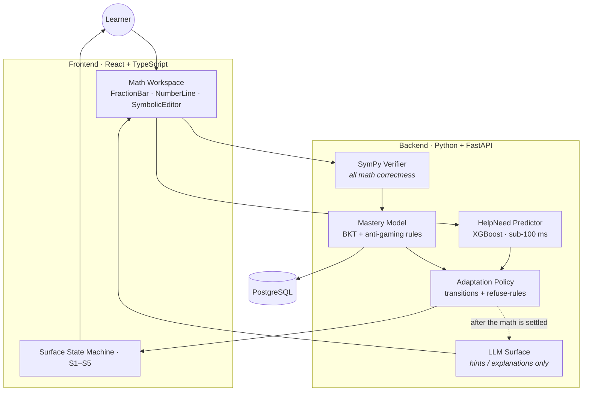

<div align="center">

# WhollyMath

### An adaptive, multimodal tutor that teaches fractions — with a mastery model you can actually trust.


</div>

---

## Why this exists

**Fractions are the single best-replicated predictor of later algebra success — more than
whole-number knowledge.** The ability to place a fraction on a number line is tied to
understanding the equal sign, variables, and equations. It's the gateway skill.

And yet the AI learning tools most students touch today fall into two shapes:

- **a chat box** — "ask me anything," with no idea whether you actually understood the answer, and
- **a static worked-example walkthrough** — the same five steps for everyone, no adaptation, no
  check that step 2 landed before showing step 3.

Neither can tell the difference between a learner who *understands* and one who is guessing,
pattern-matching a single format, or leaning on hints. **WhollyMath is built to tell the
difference — and to prove it.**

---

## What we're building

A web tutor for **fraction equivalence, addition, and subtraction**, aimed at 6th–7th graders,
with five things most tutors don't have:

| | Feature | What makes it different |
|---|---|---|
| 🎛️ | **An interface that adapts with restraint** | Five disciplined surface states (symbolic, number line, fraction bars, worked example, transfer probe) — never a chaotic morphing UI. Every transition is labeled and rule-driven. |
| 🧮 | **A mastery model that resists gaming** | "Mastered" requires correctness across ≥2 representations, at least one unassisted attempt, and *interleaved* (not blocked) practice. Guessing and hint-hunting don't get you there. |
| ✅ | **Symbolic verification, not LLM guesswork** | Every answer and step is checked by **SymPy**. A language model never decides whether your math is right. |
| 🧪 | **Five adversarial synthetic learners** | Each persona deterministically instantiates a documented misconception and tries to fool the mastery model. They are the integration test suite. |
| 📊 | **An honest evaluation** | Measured against a chat-only baseline and a static worked-example baseline, with a **transfer test** as the moment of truth — and results reported regardless of which wins. |

---

## How it fits together



> **The core invariant:** *rules decide what happened; the LLM only describes what it looks
> like.* Correctness, mastery, and state transitions are all deterministic. The LLM is additive
> — disable it and the system still works, it just talks less naturally.

📐 **Full technical map:** [`ARCHITECTURE.md`](./ARCHITECTURE.md) — every layer, the turn loop,
the state machine, the personas, and the evaluation design, with diagrams.

---

## The five adversarial learners

The mastery model is only as trustworthy as the attacks it survives. Each persona forces a
specific design rule:

| Persona | Tries to pass by… | Forces the rule… |
|---|---|---|
| **Natural-number Nate** | Surface symbolic matching, while believing ⅙ > ½ | Mastery needs ≥2 representations |
| **Procedure Priya** | Running the algorithm without understanding it | Every KC needs an "explain / find-the-error" item |
| **Hint-hunter Hugo** | Treating hints as the instruction | Mastery needs an unassisted correct attempt |
| **Surface Sam** | Looking fluent inside one problem format | Mastery is computed on interleaved practice |
| **Click-through Cleo** | Clicking fast without engaging | Engagement-floor signals flag low-effort answers |

---

## Tech stack

- **Frontend:** React + TypeScript + Vite, with custom SVG components for the math workspace.
- **Backend:** Python + FastAPI, with SymPy for all symbolic math verification.
- **Database:** PostgreSQL via SQLAlchemy.
- **ML:** scikit-learn / XGBoost for the HelpNeed predictor (interpretable, sub-10 ms inference).
- **LLM:** Claude behind a provider abstraction — used only for natural-language surface text.
- **Infra:** AWS via CDK (TypeScript) — S3 + CloudFront, ECS Fargate, RDS Postgres.

Full rationale for each choice lives in the team's internal tech-stack doc.

---

## Repository layout

```
whollymath/
├── backend/         # Python + FastAPI: domain model, mastery, policy, helpneed, personas, llm
├── frontend/        # React + TypeScript: workspace, surface state machine
├── shared-types/    # TypeScript types generated from Pydantic
├── infrastructure/  # AWS CDK
├── ARCHITECTURE.md  # ← the in-depth technical reference (start here after this file)
├── CLAUDE.md        # contribution guidelines, commit conventions, source hierarchy
└── README.md        # you are here
```

> Detailed planning, the decision log, and research citations live in internal docs kept local
> to the team (not in version control). `ARCHITECTURE.md` is the public technical reference.

---

## Status & roadmap

This is a **6-week build**. We are at the **start of Week 1**.

| Week | Focus | Status |
|---|---|---|
| **1** | Domain model (5 KCs, misconceptions, generators, SymPy verifier); mastery-model skeleton; tutor scaffolding (S1) | 🟡 In progress |
| 2 | Persona configs + simulator (Priya, Sam); reactive UI (S1–S3); mastery integrated | ⚪ Planned |
| 3 | Full persona roster (Nate, Hugo, Cleo); DataShop pull + HelpNeed v1; S4 & S5 | ⚪ Planned |
| 4 | First false-positive measurements; mastery iteration; HelpNeed calibrated + integrated | ⚪ Planned |
| 5 | Build baseline arms; run three-arm comparison + proactive A/B; LLM surface layer | ⚪ Planned |
| 6 | Demo polish, decision log, limitations memo, submission artifacts | ⚪ Planned |

---

## Running it

The build is just beginning, so there isn't a one-command launch yet. As components land, this
section will carry exact steps. The intended local flow:

```bash
# backend (Python + FastAPI)
cd backend && uv sync && uv run pytest        # tests-first; see CLAUDE.md §2
uv run uvicorn app.api.app:app --reload

# frontend (React + Vite)
cd frontend && pnpm install && pnpm dev

# local Postgres for parity with prod
docker compose up -d
```

**macOS prerequisite for the HelpNeed predictor:** XGBoost needs the OpenMP runtime.
Install it once with `brew install libomp` (Linux/CI wheels bundle it). To train the
HelpNeed v1 model on the local EDM Cup data (gitignored under `backend/data/`):

```bash
cd backend && uv run python -m app.helpneed.train_pipeline
# optional fast pass: WHOLLYMATH_EDMCUP_ROW_LIMIT=5000000 uv run python -m app.helpneed.train_pipeline
```

### The committed HelpNeed model artifact

The deployed turn loop needs a *fitted* predictor at boot, but the 1.44 GB EDM Cup
training data is gitignored (too large for git, re-downloadable from source). The
trained XGBoost model, by contrast, serializes to ~280 KB — its size is set by the tree
count/depth, not the row count — so **the one blessed artifact is checked in** at
`backend/app/helpneed/artifacts/helpneed_v1.joblib` and loaded once at boot by
`app.helpneed.artifact.load_predictor` (no network fetch on the boot path; the turn loop
stays sub-100 ms). This overrides the default `*.joblib` ignore via a single negation in
`.gitignore` (decision 2026-05-28). S3/model-registry hosting is the upgrade path if the
model ever grows or needs independent versioning — premature at this size.

Because the data is gitignored, the binary's provenance can't show in a diff, so it lives
in the decision log instead. **Reproduce the committed artifact** (XGBoost, fit on all
~95.8k examples from the first 5M action rows; holdout AUC 0.893, RESEARCH.md §7.2):

```bash
cd backend && WHOLLYMATH_EDMCUP_ROW_LIMIT=5000000 \
  WHOLLYMATH_HELPNEED_OUT=app/helpneed/artifacts/helpneed_v1.joblib \
  uv run python -m app.helpneed.train_pipeline
```

The predictor scores each answered turn **observe-only** — the API returns it as
`help_need`, but nothing acts on it yet (interventions are a later slice).

---

## How this project is built

- **The domain model and mastery model are developed test-first** — they are load-bearing, so a
  test asserting the behavior comes before the implementation.
- **Commit messages are the decision log.** Each one cites the source (PRD, design doc, or
  research finding) behind a change.
- **Workflow is trunk-based:** small commits straight to `main`.

See [`CLAUDE.md`](./CLAUDE.md) for the full guidelines.

---

## Grounded in research

Every major design choice traces to a finding, not a hunch. A few that shaped the system:

- **Fractions predict algebra readiness** more than whole-number knowledge (Bailey et al. 2012;
  Booth & Newton 2012) → chose the domain.
- **Interleaved practice beats blocked practice** for transfer in 7th-grade fraction arithmetic
  (Rohrer et al. 2014, 2015) → the mastery model scores interleaved practice, not blocks.
- **LLM step-level math verification is an open problem** (Daheim et al. 2024) → SymPy owns all
  correctness checking.
- **Students who most need help are least likely to ask** (Maniktala et al. 2020) → inline,
  proactive help instead of hidden hint buttons.
- **Proactive help can underperform reactive help** (Razzaq & Heffernan 2010) → we A/B test it
  rather than assume it wins.
